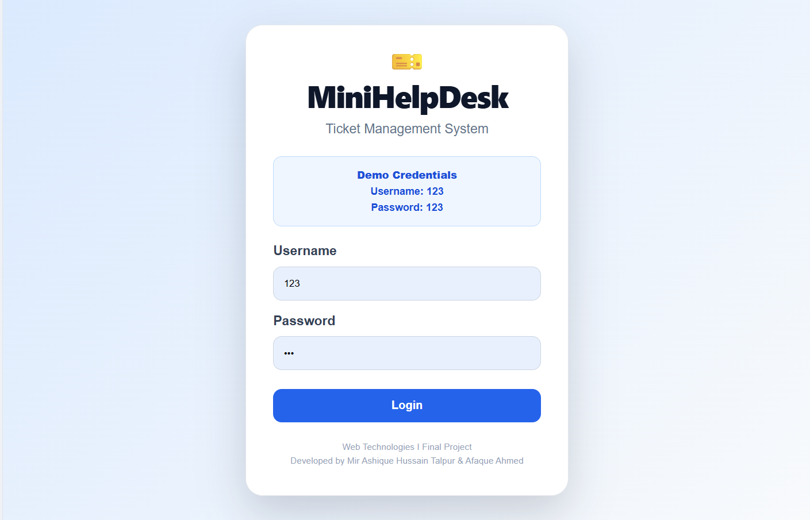
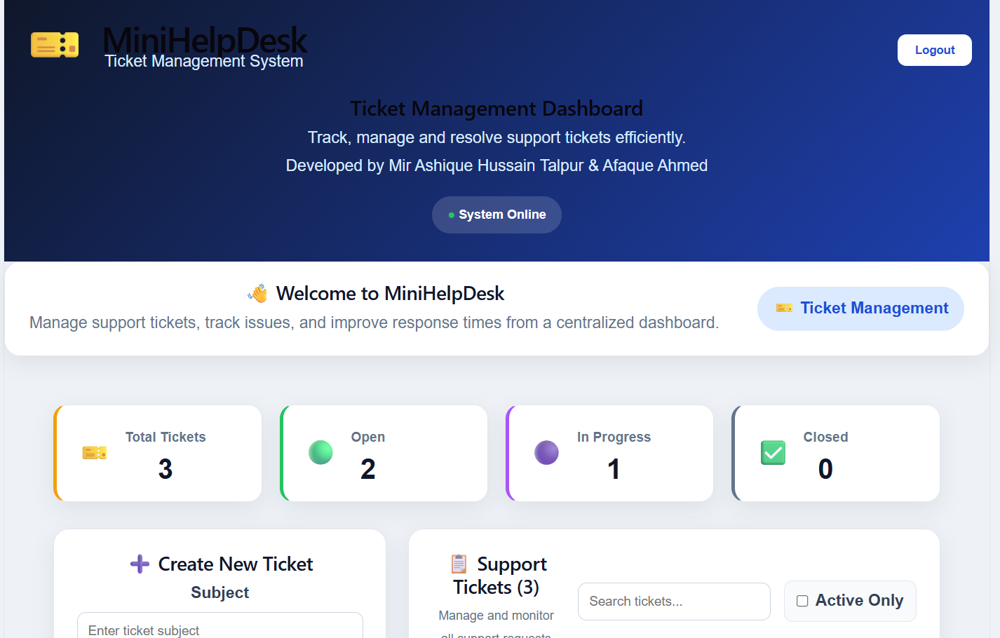
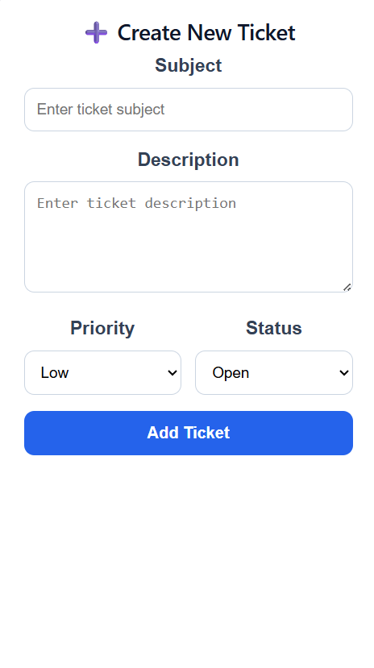
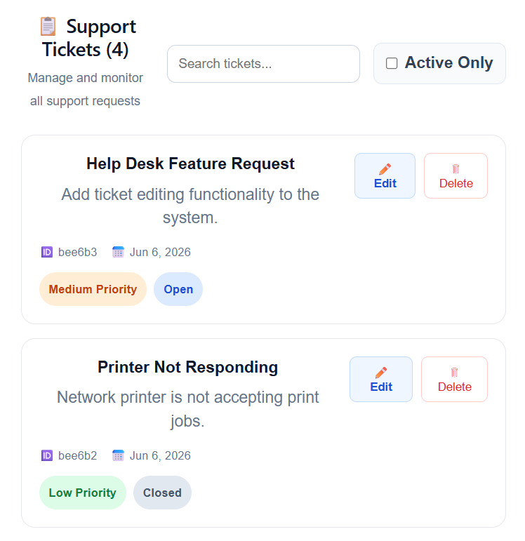
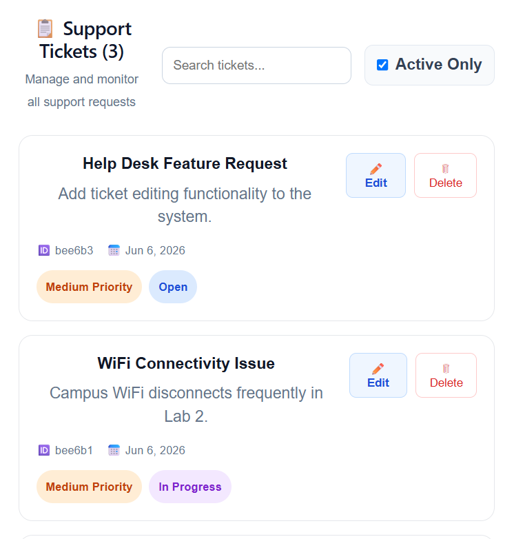
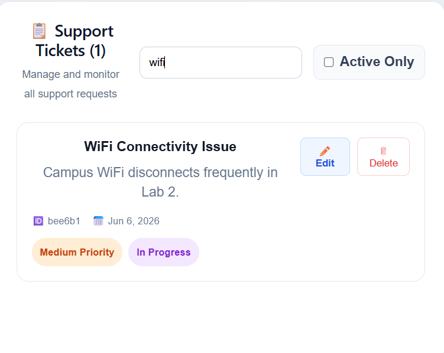
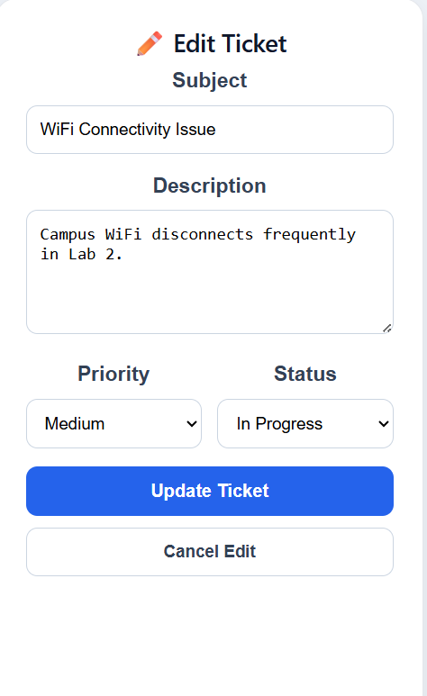

# 🎫 MiniHelpDesk - Ticket Management System

A full-stack Ticket Management System developed using **React.js**, **Node.js**, **Express.js**, and **MongoDB Atlas**. The application allows users to create, manage, edit, delete, search, and track support tickets through an intuitive dashboard.

---

## 🚀 Live Demo

### Frontend

https://minihelpdesk-frontend.onrender.com

### Backend API

https://minihelpdesk-backend-jdu5.onrender.com

---

## 📂 GitHub Repository

https://github.com/MirAshique/minihelpdesk-final-project

---

## 👨‍💻 Developers

### Mir Ashique Hussain Talpur

* Registration No: 2312155

### Afaque Ahmed

* Registration No: 2312104

### University

SZABIST Larkana Campus

### Course

Web Technologies I

### Semester

BSCS 6-B

### Year

2026

---

## 📌 Project Overview

MiniHelpDesk is a web-based support ticket management system designed to simplify ticket tracking and issue management.

The system enables users to:

* Create support tickets
* Edit ticket information
* Delete tickets
* Search tickets instantly
* Filter active tickets
* Track ticket status
* Monitor dashboard statistics
* Store ticket data in MongoDB Atlas

---

## 🛠️ Technologies Used

### Frontend

* React.js
* Vite
* Axios
* CSS3

### Backend

* Node.js
* Express.js
* MongoDB Atlas
* Mongoose

### Deployment

* Render
* GitHub

---

## ✨ Features

### Authentication

* Demo Login System

### Ticket Management

* Create New Ticket
* Edit Existing Ticket
* Delete Ticket
* Update Ticket Status
* Update Ticket Priority

### Search & Filter

* Search Tickets by Subject
* Active Only Filter
* Closed Ticket Management

### Dashboard Statistics

* Total Tickets Counter
* Open Tickets Counter
* In Progress Tickets Counter
* Closed Tickets Counter

### Database Integration

* MongoDB Atlas Connection
* Persistent Ticket Storage

---

## 📊 Ticket Status Workflow

Open

⬇

In Progress

⬇

Closed

---

## 📸 Screenshots

### Login Page



---

### Dashboard



---

### Ticket Statistics


---

### Create Ticket



---

### Ticket List



---

### Active Tickets Filter



---

### Search Functionality



---

### Edit Ticket



---

## 🗂️ Sample Ticket Data

| Subject                   | Priority | Status      |
| ------------------------- | -------- | ----------- |
| Help Desk Feature Request | Medium   | Open        |
| WiFi Connectivity Issue   | Medium   | In Progress |
| Student Portal Access     | High     | Open        |
| Printer Not Responding    | Low      | Closed      |

---

## 📈 Dashboard Example

| Metric              | Count |
| ------------------- | ----- |
| Total Tickets       | 4     |
| Open Tickets        | 2     |
| In Progress Tickets | 1     |
| Closed Tickets      | 1     |

---

## ⚙️ Installation Guide

### Clone Repository

```bash
git clone https://github.com/MirAshique/minihelpdesk-final-project.git
```

---

### Backend Setup

```bash
cd backend

npm install

npm start
```

Backend runs on:

```bash
http://localhost:5000
```

---

### Frontend Setup

```bash
cd frontend

npm install

npm run dev
```

Frontend runs on:

```bash
http://localhost:5173
```

---

## 🔐 Environment Variables

Create a `.env` file inside the backend folder:

```env
PORT=5000

MONGO_URI=your_mongodb_connection_string
```

---

## 🔗 API Endpoints

### Get All Tickets

```http
GET /api/tickets
```

### Create Ticket

```http
POST /api/tickets
```

### Update Ticket

```http
PUT /api/tickets/:id
```

### Delete Ticket

```http
DELETE /api/tickets/:id
```

---

## 📁 Project Structure

```text
minihelpdesk-final-project
│
├── backend
│   ├── controllers
│   ├── models
│   ├── routes
│   ├── server.js
│   └── package.json
│
├── frontend
│   ├── src
│   ├── components
│   ├── services
│   ├── pages
│   └── package.json
│
├── screenshots
│   ├── login.png
│   ├── dashboard.png
│   ├── stats.png
│   ├── create-ticket.png
│   ├── ticket-list.png
│   ├── active-filter.png
│   ├── search.png
│   └── edit-ticket.png
│
└── README.md
```

---

## 🎓 Academic Project

This project was developed as the **Final Project for Web Technologies I** at **SZABIST Larkana Campus**.

---

## 📄 License

This project is developed for educational and academic purposes only.

---

## ⭐ Acknowledgment

Special thanks to our instructor and SZABIST Sukkur for providing the opportunity to build and deploy a full-stack web application using modern web technologies.
